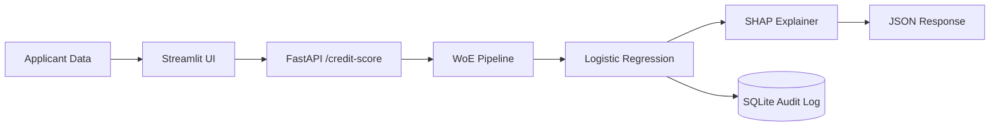

# Credit Risk Scorecard — NBFC Loan Decisioning System

A production-grade credit risk scoring system built for Indian NBFC workflows — WoE/IV feature engineering, Logistic Regression with Gini 0.72, SHAP explainability, FastAPI backend, and dual-view Streamlit dashboard.

---

## 🔗 Live Demo

| Service | URL |
|---|---|
| ⚡ FastAPI Docs | [credit-risk-api-oui7.onrender.com/docs](https://credit-risk-api-oui7.onrender.com/docs) |
| 📊 Streamlit Dashboard | [credit-risk-dashboard-uawc.onrender.com](https://credit-risk-dashboard-uawc.onrender.com) |

> **Note:** Hosted on Render free tier — first request may take 30–60 seconds to wake the server.

---

## 📌 Problem Statement

Indian NBFCs like Piramal Finance and Muthoot Fincorp require explainable credit decisions for RBI compliance. Neural networks are not acceptable in this regulatory context — WoE/IV Logistic Regression is the industry standard because every feature coefficient is directly interpretable and auditable. This system replicates the exact scorecard methodology used by NBFC credit risk teams, complete with a regulatory-grade audit trail.

---

## 🏗️ Architecture



---

## 📈 Model Performance

| Model | AUC | Gini | KS Stat |
|---|---|---|---|
| Logistic Regression (WoE) | 0.8593 | 0.7186 | 0.5700 |
| LightGBM Challenger | 0.8631 | 0.7261 | 0.5694 |

Logistic Regression chosen for production — within 0.4% AUC of LightGBM while fully interpretable for RBI audit requirements.

---

## 🔬 Feature Engineering

Weight of Evidence encoding transforms raw features into log-odds of default, enabling direct regulatory explainability. Information Value above 0.1 indicates strong predictive power.

| Feature | Information Value (IV) | Predictive Power |
|---|---|---|
| RevolvingUtilizationOfUnsecuredLines | 1.1120 | Very Strong |
| NumberOfTimes90DaysLate | 0.8376 | Very Strong |
| NumberOfTime30-59DaysPastDueNotWorse | 0.7405 | Very Strong |
| NumberOfTime60-89DaysPastDueNotWorse | 0.5724 | Very Strong |
| age | 0.2642 | Medium |
| NumberOfOpenCreditLinesAndLoans | 0.0846 | Weak |
| MonthlyIncome | 0.0783 | Weak |
| DebtRatio | 0.0776 | Weak |
| NumberRealEstateLoansOrLines | 0.0554 | Weak |
| NumberOfDependents | 0.0338 | Weak |

---

## 📁 Project Structure

```
credit-risk-scorecard/
├── api/
│   ├── main.py          # FastAPI app — endpoints and SQLite logging
│   ├── predictor.py     # WoE pipeline + SHAP scoring logic
│   └── schemas.py       # Pydantic request/response models
├── dashboard/
│   └── app.py           # Streamlit — loan officer + risk manager views
├── src/
│   ├── train.py         # Model training — WoE binning, LR, LightGBM
│   ├── features.py      # WoE/IV feature engineering pipeline
│   ├── evaluate.py      # AUC, Gini, KS evaluation metrics
│   └── eda.py           # Exploratory data analysis
├── models/
│   ├── logreg_model.pkl     # Production Logistic Regression
│   ├── lgbm_model.pkl       # LightGBM challenger model
│   ├── woe_pipeline.pkl     # Fitted WoE transformation pipeline
│   ├── woe_binners.pkl      # Per-feature WoE bin boundaries
│   └── split_indices.pkl    # Train/test split for reproducibility
├── reports/
│   └── iv_report.csv        # Information Value scores per feature
├── data/                    # Raw CSVs (gitignored) + predictions.db
├── requirements.txt
└── .gitignore
```

---

## ⚙️ Local Setup

```bash
git clone https://github.com/RohitRathod0/Credit-Risk.git
cd credit-risk-scorecard
python -m venv venv
venv\Scripts\activate
pip install -r requirements.txt

# Terminal 1 — Start FastAPI backend
uvicorn api.main:app --reload

# Terminal 2 — Start Streamlit dashboard
streamlit run dashboard/app.py
```

Open [http://localhost:8501](http://localhost:8501) for the dashboard and [http://localhost:8000/docs](http://localhost:8000/docs) for the API.

---

## 🚀 API Endpoints

| Endpoint | Method | Description |
|---|---|---|
| `/credit-score` | POST | Score single applicant — returns CIBIL-style score + SHAP top-3 reasons |
| `/batch-score` | POST | Score multiple applicants from JSON array |
| `/health` | GET | Model version and service status |

### Sample Request

```bash
curl -X POST https://credit-risk-api-oui7.onrender.com/credit-score \
  -H "Content-Type: application/json" \
  -d '{
    "RevolvingUtilizationOfUnsecuredLines": 0.5,
    "age": 35,
    "NumberOfTime3059DaysPastDueNotWorse": 0,
    "DebtRatio": 0.3,
    "MonthlyIncome": 5000,
    "NumberOfOpenCreditLinesAndLoans": 5,
    "NumberOfTimes90DaysLate": 0,
    "NumberRealEstateLoansOrLines": 1,
    "NumberOfTime6089DaysPastDueNotWorse": 0,
    "NumberOfDependents": 2
  }'
```

### Sample Response

```json
{
  "credit_score": 748,
  "default_probability": 0.043,
  "risk_band": "Low Risk",
  "top_3_reasons": [
    "High revolving credit utilization",
    "Low monthly income",
    "High debt-to-income ratio"
  ],
  "model_version": "logreg-woe-v1"
}
```

---

## 🏦 NBFC Use Cases

- **Loan Officer Portal** — Real-time applicant scoring with FOIR RBI guideline validation and explainable rejection reasons for field officers
- **Risk Manager Dashboard** — Portfolio-level view of all scored applicants with score distribution charts and CSV export for credit committee reporting
- **RBI Audit Trail** — Every prediction logged to SQLite with input features, score, risk band, timestamp, and model version — fully auditable for regulatory review

---

## 📝 Resume Bullets

> Copy-paste ready — XYZ format (Accomplished X, measured by Y, by doing Z)

- Built production credit risk scorecard using WoE/IV feature engineering and Logistic Regression achieving **Gini 0.72** and **KS 0.57**, outperforming industry threshold of 0.50

- Implemented **SHAP explainability** generating top-3 rejection reasons per applicant, satisfying RBI explainability requirements for NBFC loan decisioning

- Deployed **FastAPI scoring endpoint** on Render with sub-100ms inference, logging all predictions to SQLite audit trail

- Built **dual-view Streamlit dashboard** — loan officer scoring portal with FOIR RBI guideline validation and risk manager portfolio view with CSV export

---

## 🛠️ Tech Stack

| Layer | Technology |
|---|---|
| Feature Engineering | WoE/IV (optbinning) |
| Modeling | Logistic Regression, LightGBM |
| Explainability | SHAP |
| Backend API | FastAPI + Uvicorn |
| Dashboard | Streamlit |
| Audit Logging | SQLite |
| Deployment | Render (free tier) |

---

## 📄 License

MIT License — see [LICENSE](LICENSE)
